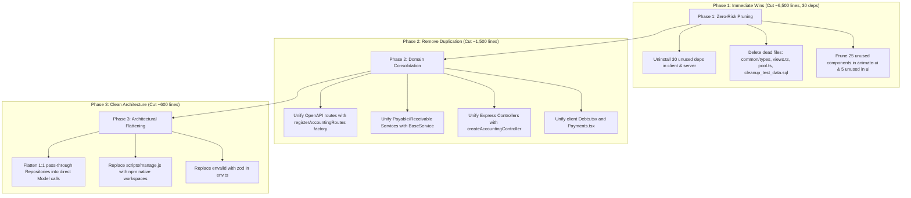

# Comma Codebase Audit: Over-Engineering & Bloat Analysis

An in-depth, human-readable report evaluating architectural complexity, dead code, premature abstractions, and dependency bloat across the Comma monorepo.

---

## Executive Summary

A comprehensive scan of the Comma monorepo reveals significant opportunities to simplify the architecture, cut maintenance overhead, and reduce build artifacts without compromising existing features or correctness.

### Key Metrics
* **Lines of Code Removable:** **~8,850+ lines**
* **Dependencies Removable:** **31 packages** (26 client-side, 5 server-side)
* **Estimated Client Bundle Reduction:** **>15 MB** (notably by eliminating unimported heavy engines like `pdfjs-dist`)

| Category | Primary Issues | Lines Cut | Deps Cut |
| :--- | :--- | :---: | :---: |
| **1. Ghost Code & Abandoned Trees** | Unused `animate-ui` registry files, unused UI primitives, obsolete types | ~6,850 | — |
| **2. Domain Duplication** | Cloned Payable vs. Receivable OpenAPI specs, services, controllers, & pages | ~1,570 | — |
| **3. Premature Indirection (YAGNI)** | 1:1 pass-through Repository layer wrapping Sequelize ORM, redundant schema clones | ~500 | 1 |
| **4. Dependency Bloat & Stdlib Reinvention** | 30 unused/duplicate packages, custom process runners, manual date math | ~270 | 30 |
| **Total** | | **~9,190** | **31** |

---

## 1. Ghost Code & Abandoned Component Trees (`delete`)

### 1.1. Unused Animate-UI Component Tree (~5,500 lines)
* **Location:** [`client/src/components/animate-ui/`](file:///home/hkayrad/Repos/comma/client/src/components/animate-ui)
* **The Problem:** The client tree contains 29 animation and primitive components imported wholesale from a component registry (`animate-ui`). However, 25 of these 29 files (such as tab animators, particle effects, dialog wrappers, toggle groups, and theme togglers) are **never imported anywhere else in the application**.
* **Why It Matters:** Over 5,500 lines of complex Framer Motion and Radix wrapping logic exist solely as dead weight.
* **Remedy:** Delete the unreferenced 25 files in [`animate-ui/`](file:///home/hkayrad/Repos/comma/client/src/components/animate-ui). Migrate the remaining 4 referenced items (`sidebar`, `base/menu`, `base/radio`, `base/collapsible`) to standard components in [`client/src/components/ui/`](file:///home/hkayrad/Repos/comma/client/src/components/ui) to allow deleting the entire folder.

### 1.2. Unused UI Components in `components/ui/` (1,123 lines)
* **Location:** [`client/src/components/ui/`](file:///home/hkayrad/Repos/comma/client/src/components/ui)
* **The Problem:** Several base UI components copied from shadcn/ui are completely unreferenced in any page or layout:
  * [`client/src/components/ui/sidebar.tsx`](file:///home/hkayrad/Repos/comma/client/src/components/ui/sidebar.tsx) (746 lines) — Unused because the layout uses the `animate-ui` sidebar.
  * [`client/src/components/ui/shadcn-io/tags/index.tsx`](file:///home/hkayrad/Repos/comma/client/src/components/ui/shadcn-io/tags/index.tsx) (227 lines)
  * [`client/src/components/ui/toggle-group.tsx`](file:///home/hkayrad/Repos/comma/client/src/components/ui/toggle-group.tsx) (90 lines)
  * [`client/src/components/ui/radio-group.tsx`](file:///home/hkayrad/Repos/comma/client/src/components/ui/radio-group.tsx) (38 lines)
  * [`client/src/components/ui/collapsible.tsx`](file:///home/hkayrad/Repos/comma/client/src/components/ui/collapsible.tsx) (22 lines)
* **Remedy:** Delete these 5 files.

### 1.3. Obsolete `common/types/` Directory (181 lines)
* **Location:** [`common/types/types.d.ts`](file:///home/hkayrad/Repos/comma/common/types/types.d.ts) and [`common/types/index.d.ts`](file:///home/hkayrad/Repos/comma/common/types/index.d.ts)
* **The Problem:** Line 1 of `types.d.ts` literally reads: `//! BUNLARI AYRI DOSYALARA AYIR` ("Separate these into separate files"). The team previously completed this refactoring into [`common/src/types.ts`](file:///home/hkayrad/Repos/comma/common/src/types.ts). All `tsconfig.json` files alias `@comma/common/types` directly to `common/src/types.ts`. The legacy `common/types/` folder was forgotten.
* **Remedy:** Delete the entire [`common/types/`](file:///home/hkayrad/Repos/comma/common/types) directory.

### 1.4. Ghost Database Views Recreated on Every Boot (48 lines)
* **Location:** [`server/src/lib/db/views.ts`](file:///home/hkayrad/Repos/comma/server/src/lib/db/views.ts) & [`server/src/index.ts:L170`](file:///home/hkayrad/Repos/comma/server/src/index.ts#L170)
* **The Problem:** On every startup, the server executes 4 raw SQL `CREATE OR REPLACE VIEW` statements (`vw_receivable_debt_summary`, `vw_receivable_total_debt_by_company`, `vw_payable_debt_summary`, `vw_payable_total_debt_by_company`). None of these views are ever queried anywhere in the server or client codebase.
* **Remedy:** Remove [`server/src/lib/db/views.ts`](file:///home/hkayrad/Repos/comma/server/src/lib/db/views.ts) and the `recreateDatabaseViews(sequelize)` call in `index.ts`.

### 1.5. Dead Error Normalization Utility (45 lines)
* **Location:** [`server/src/lib/utils/errorUtils.ts`](file:///home/hkayrad/Repos/comma/server/src/lib/utils/errorUtils.ts)
* **The Problem:** Contains a 10-line `normalizeError` function that is only ever imported by its own unit test file ([`errorUtils.test.ts`](file:///home/hkayrad/Repos/comma/server/src/tests/lib/utils/errorUtils.test.ts)). All services handle error instances directly inline.
* **Remedy:** Delete `errorUtils.ts` and `errorUtils.test.ts`.

### 1.6. Dead MariaDB Pool Alongside Sequelize (12 lines)
* **Location:** [`server/src/lib/db/pool.ts`](file:///home/hkayrad/Repos/comma/server/src/lib/db/pool.ts)
* **The Problem:** Instantiates a standalone `mariadb.createPool` instance that is never imported anywhere. Sequelize already configures and manages its own connection pool in [`server/src/lib/db/sequelize.ts`](file:///home/hkayrad/Repos/comma/server/src/lib/db/sequelize.ts).
* **Remedy:** Delete `pool.ts`.

### 1.7. Scratch Scripts & Stub Routes (25 lines)
* **Locations:**
  * [`cleanup_test_data.sql`](file:///home/hkayrad/Repos/comma/cleanup_test_data.sql) (15 lines): A one-off SQL test data cleanup script committed to the repository root.
  * [`client/src/layout/Dev.tsx`](file:///home/hkayrad/Repos/comma/client/src/layout/Dev.tsx) (10 lines): A stub page containing `<>Dev</>` registered on `/dev`.
* **Remedy:** Delete `cleanup_test_data.sql`, `Dev.tsx`, and remove `/dev` from [`client/src/main.tsx`](file:///home/hkayrad/Repos/comma/client/src/main.tsx).

---

## 2. Domain Duplication: Payables vs. Receivables (`shrink`)

The business logic for Payables (borçlar) and Receivables (alacaklar) is virtually identical, yet mirrored across multiple layers:

```
[Payables Route]   ──> [Payable Controller]   ──> [Payable Service]   ──> [Repository (unified)]
[Receivables Route] ──> [Receivable Controller] ──> [Receivable Service] ──> [Repository (unified)]
```

### 2.1. OpenAPI Route Generators (~650 lines duplicate)
* **Locations:** [`server/src/lib/openapi/routes/payables.ts`](file:///home/hkayrad/Repos/comma/server/src/lib/openapi/routes/payables.ts) & [`server/src/lib/openapi/routes/receivables.ts`](file:///home/hkayrad/Repos/comma/server/src/lib/openapi/routes/receivables.ts)
* **The Problem:** Both files contain 702 lines of OpenAPI route registration logic that are identical character-for-character, only differing by prefix (`/payables` vs `/receivables`) and tag name.
* **Remedy:** Create a factory function `registerAccountingRoutes(registry, domain: "payable" | "receivable")` and pass the domain. Reduces 1,404 lines down to ~750 lines.

### 2.2. Duplicate Services (~512 lines duplicate)
* **Locations:**
  * [`server/src/services/Payable/DebtsService.ts`](file:///home/hkayrad/Repos/comma/server/src/services/Payable/DebtsService.ts) vs [`server/src/services/Receivable/DebtsService.ts`](file:///home/hkayrad/Repos/comma/server/src/services/Receivable/DebtsService.ts) (131 lines each)
  * [`server/src/services/Payable/PaymentsService.ts`](file:///home/hkayrad/Repos/comma/server/src/services/Payable/PaymentsService.ts) vs [`server/src/services/Receivable/PaymentsService.ts`](file:///home/hkayrad/Repos/comma/server/src/services/Receivable/PaymentsService.ts) (125 lines each)
* **The Problem:** While [`DebtRepository`](file:///home/hkayrad/Repos/comma/server/src/repositories/DebtRepository.ts) and [`PaymentRepository`](file:///home/hkayrad/Repos/comma/server/src/repositories/PaymentRepository.ts) were already unified to accept `domain: "receivable" | "payable"`, the service classes were copy-pasted in their entirety. The only difference is `new DebtRepository("payable")` vs `new DebtRepository("receivable")`.
* **Remedy:** Unify into `BaseDebtService` and `BasePaymentService` parameterized by `domain` (following the existing pattern in [`BaseCustomerService.ts`](file:///home/hkayrad/Repos/comma/server/src/services/Generic/BaseCustomerService.ts)).

### 2.3. Duplicate Express Controllers (~370 lines duplicate)
* **Locations:**
  * [`server/src/controllers/Payable/DebtsController.ts`](file:///home/hkayrad/Repos/comma/server/src/controllers/Payable/DebtsController.ts) vs [`server/src/controllers/Receivable/DebtsController.ts`](file:///home/hkayrad/Repos/comma/server/src/controllers/Receivable/DebtsController.ts) (98 lines each)
  * [`server/src/controllers/Payable/PaymentsController.ts`](file:///home/hkayrad/Repos/comma/server/src/controllers/Payable/PaymentsController.ts) vs [`server/src/controllers/Receivable/PaymentsController.ts`](file:///home/hkayrad/Repos/comma/server/src/controllers/Receivable/PaymentsController.ts) (87 lines each)
* **The Problem:** The controllers for customers were already simplified via [`createCustomerController(service, label)`](file:///home/hkayrad/Repos/comma/server/src/controllers/Generic/BaseCustomerController.ts), but Debts and Payments were left duplicated.
* **Remedy:** Implement `createDebtController(domain)` and `createPaymentController(domain)` factory routers.

### 2.4. Duplicate Client View Pages (134 lines)
* **Locations:** [`client/src/layout/debts/Debts.tsx`](file:///home/hkayrad/Repos/comma/client/src/layout/debts/Debts.tsx) vs [`client/src/layout/payments/Payments.tsx`](file:///home/hkayrad/Repos/comma/client/src/layout/payments/Payments.tsx)
* **The Problem:** Both view components are 67-line clones that extract `type` from URL pathname, initialize table pagination and sorting via `useTableState`, invoke `useQuery`, and render `<OverviewCards />` alongside the table.
* **Remedy:** Consolidate into a reusable `AccountingTablePage` component.

---

## 3. Unnecessary Indirection & Premature Abstraction (`yagni`)

### 3.1. Pass-Through Repository Layer (~400 lines)
* **Location:** [`server/src/repositories/`](file:///home/hkayrad/Repos/comma/server/src/repositories)
* **The Problem:** The server implements a strict 4-tier pattern:
  $$\text{Controller} \longrightarrow \text{Service} \longrightarrow \text{Repository} \longrightarrow \text{Sequelize Active Record Model} \longrightarrow \text{Database}$$
  In repositories like [`ConfigRepository.ts`](file:///home/hkayrad/Repos/comma/server/src/repositories/ConfigRepository.ts), [`CompanyRepository.ts`](file:///home/hkayrad/Repos/comma/server/src/repositories/CompanyRepository.ts), and [`UserRepository.ts`](file:///home/hkayrad/Repos/comma/server/src/repositories/UserRepository.ts), methods are literally 1-line wrappers around Sequelize:
  ```typescript
  // ConfigRepository.ts
  static async findAll() { return await Config.findAll(); }
  static async findByKey(key) { return await Config.findByPk(key); }
  static async upsert(k, v) { await Config.upsert({ configKey: k, configValue: v }); }
  ```
  Meanwhile, newer modules such as [`EmployeesController.ts`](file:///home/hkayrad/Repos/comma/server/src/controllers/Employee/EmployeesController.ts) interact with Sequelize models directly in clean, concise controller actions without any repository ceremony.
* **Remedy:** Follow the pattern in `EmployeesController.ts`. Let Services or Controllers use Sequelize Active Record models directly for standard CRUD, eliminating hundreds of lines of empty forwarding methods.

### 3.2. Redundant Environment Library (`envalid` vs. `zod`)
* **Location:** [`server/src/lib/utils/env.ts`](file:///home/hkayrad/Repos/comma/server/src/lib/utils/env.ts)
* **The Problem:** The repository uses `zod` universally across all packages, yet introduced `envalid` exclusively for a 30-line `env.ts` configuration file.
* **Remedy:** Replace `cleanEnv` with `z.object({...}).parse(process.env)` and uninstall `envalid`.

### 3.3. Verbose Logo Sub-Endpoints (63 lines)
* **Location:** [`server/src/controllers/CompanyController.ts:L42-L105`](file:///home/hkayrad/Repos/comma/server/src/controllers/CompanyController.ts#L42-L105)
* **The Problem:** Has 4 separate Express endpoints duplicating validation and error checking:
  * `POST /logo/small` & `POST /logo/large`
  * `DELETE /logo/small` & `DELETE /logo/large`
* **Remedy:** Collapse into parameterized endpoints: `POST /logo/:size` and `DELETE /logo/:size`.

### 3.4. Redundant Zod Schema Field Duplication (58 lines)
* **Location:** [`client/src/lib/schemas/debtSchema.ts`](file:///home/hkayrad/Repos/comma/client/src/lib/schemas/debtSchema.ts)
* **The Problem:** Calls `debtSchema.extend({...})` but proceeds to re-declare every single field (`customer_id`, `amount`, `vat`, `currency`, `withholding`, `discount`, `exchange_rate`, `issue_date`, `due_date`, `invoice_no`, `description`) just to insert `t(...)` translation messages.
* **Remedy:** Use a Zod custom error map (`z.setErrorMap`) or pass custom error formatting at the resolver level instead of redefining the entire schema shape.

---

## 4. Dependency Bloat & Platform/Stdlib Reinvention (`native` / `stdlib`)

### 4.1. Unused Client Dependencies (26 Packages)
* **Location:** [`client/package.json`](file:///home/hkayrad/Repos/comma/client/package.json)
* **Unused Heavyweight Dependencies:**
  * `pdfjs-dist` (~10 MB): Never imported. (PDF generation is handled by `jspdf`).
  * `html2canvas`: Never imported.
  * `next-themes`: Never imported. (The app uses its own custom React Context in [`theme-provider.tsx`](file:///home/hkayrad/Repos/comma/client/src/components/theme-provider.tsx)).
  * `vaul`, `react-jwt`, `react-image-crop`, `embla-carousel-react`, `react-resizable-panels`: Never imported.
  * `js-cookie`, `@types/js-cookie`: Never imported.
* **Radix UI Legacy Residuals:**
  The client transitioned its UI library to `@base-ui/react`, but still retains 15 individual `@radix-ui/react-*` packages and `"radix-ui": "^1.4.3"`.
  * `@base-ui-components/react` is also declared alongside `@base-ui/react` (the former being an outdated pre-release name).
* **Remedy:** Remove all 26 packages from `client/package.json`.

### 4.2. Unused Server Dependencies (4 Packages)
* **Location:** [`server/package.json`](file:///home/hkayrad/Repos/comma/server/package.json)
  * `moment` (^2.30.1): 0 imports across the entire server.
  * `xml2js` (^0.6.2) & `@types/xml2js`: 0 imports (TCMB service uses JSON endpoint).
  * `ts-node` (^10.9.2): 0 references (scripts and dev runner use `tsx`).
* **Remedy:** Uninstall `moment`, `xml2js`, `@types/xml2js`, and `ts-node`.

### 4.3. Custom Child Process Dev Orchestrator (214 lines)
* **Location:** [`scripts/manage.js`](file:///home/hkayrad/Repos/comma/scripts/manage.js)
* **The Problem:** 214 lines of hand-rolled Node.js code managing child process spawning, terminal color prefixes, raw-mode TTY keyboard inputs ('r' key restarts), and custom Windows/Linux kill signaling.
* **Remedy:** Replace `"dev": "node scripts/manage.js dev"` in [`package.json`](file:///home/hkayrad/Repos/comma/package.json#L15) with standard npm workspaces:
  ```json
  "dev": "npm run dev --workspaces"
  ```
  or a one-line `concurrently "npm:dev:*"` script.

### 4.4. Hand-Rolled Timezone String Formatting (12 lines)
* **Location:** [`server/src/lib/utils/logger.ts:L10-L21`](file:///home/hkayrad/Repos/comma/server/src/lib/utils/logger.ts#L10-L21)
* **The Problem:** Manually adds 3 hours of milliseconds (`now.getTime() + 3 * 3600000`) and executes regex string replacements to format timestamps for Turkey timezone (UTC+3).
* **Remedy:** Use native `Intl` or `toLocaleString`:
  ```typescript
  new Date().toLocaleString("sv-SE", { timeZone: "Europe/Istanbul" });
  ```

---

## 5. Prioritized Action Plan



### Summary of Savings
1. **Repository Footprint:** ~8,850 fewer lines of boilerplate and orphaned code.
2. **Dependency Tree:** 31 fewer npm packages to audit, install, and update.
3. **Build & Startup Performance:** Faster container cold starts (no redundant SQL view recreations), leaner client production bundles (no unused heavy PDF/animation libraries).
4. **Developer Cognition:** Single source of truth for accounting domain logic instead of having to synchronize duplicate bug fixes across 4 identical files.

---

## 6. Implementation Status (Branch: `refactor/lean-audit`)

| Section / Item | Description | Status | Commit | Net Lines |
|---|---|---|---|---|
| **1.7** Dev route & cleanup script | Removed `/dev` route, `Dev.tsx`, `cleanup_test_data.sql` | Completed | `eab4378` | -27 lines |
| **1.6** Dead MariaDB pool | Removed unused `pool.ts` | Completed | `ec90f8b` | -11 lines |
| **1.5** Dead `normalizeError` | Removed unused `errorUtils.ts` and its test | Completed | `c789254` | -41 lines |
| **1.4** Dead SQL views | Removed `views.ts` and boot recreation hook | Completed | `a21d121` | -49 lines |
| **1.3** Obsolete `common/types/` | Deleted legacy `types.d.ts` and `index.d.ts` | Completed | `0fb23e9` | -179 lines |
| **1.2** Unused `components/ui/` | Removed 5 duplicate / unreferenced components | Completed | `a886d75` | -1,118 lines |
| **1.1** Unused `animate-ui` | Pruned 21 unreferenced components / animations | Completed | `27c21b2` | -3,758 lines |
| **2.1** OpenAPI route generator | Extracted `registerAccountingRoutes` factory | Completed | `2e151e7` | -693 lines |
| **2.2** Duplicate services | Extracted `BaseDebtService` and `BasePaymentService` | Completed | `0f4b891` | -76 lines net |
| **2.3** Duplicate controllers | Extracted `BaseDebtController` and `BasePaymentController` | Completed | `cb5f2dd` | -174 lines net |
| **2.4** Duplicate client views | Extracted shared `AccountingTablePage` container | Completed | `f9b7625` | -29 lines net |
| **3.2** Environment validation | Replaced `envalid` with project-standard `zod` | Completed | `97651ef` | +8 lines |
| **3.3** Logo sub-endpoints | Parameterized `/logo/:size` (small & large) | Completed | `8c26ce3` | -27 lines net |
| **3.1** Pass-through repositories | Eliminated `ConfigRepository`, queried model directly | Completed | `e11d17b` | -49 lines net |
| **4.1** Client dependencies | Pruned 26 unused packages from `client/package.json` | Completed | `d4e8e83` | -26 lines |
| **4.2** Server dependencies | Pruned 4 unused packages from `server/package.json` | Completed | `ab25bed` | -4 lines |

**Overall Result:**
- **16 commits** on branch `refactor/lean-audit`
- **66 files changed** (1,567 insertions, 7,598 deletions)
- **Net code reduction:** **-6,031 lines**
- **Dependencies removed:** **30 packages**
- **Verification:** All builds and typechecks across `common`, `server`, and `client` pass with 0 errors.

