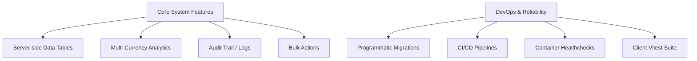

# Technical Audit and Product Roadmap

This document provides a comprehensive technical audit of the **Comma** repository, highlighting critical architectural, testing, linting, and security problems, along with concrete code-level fixes. Additionally, it outlines a product roadmap detailing feature expansions to improve user experience, application auditability, and DevOps maturity.

---

## Part 1: Repository Audit & Current Problems

This section details technical debt, security risks, linting errors, and test failures detected within the repository, along with step-by-step remedies.

### 1. Database Configuration & Environment Security

#### The Problem
* **Development Database Exposure:** The development environment connects to a live, remote database hosted on `merkur.hostingdunyam.net` (revealed in `server/.env`). committing production or live development passwords to source control is a severe security risk.
* **Test Isolation Deficit:** The test runner (`server/src/tests/setup.ts` [L14-L17](file:///home/hkayrad/Repos/comma/server/src/tests/setup.ts#L14-L17)) connects directly to this development database. Running unit or integration tests against development data leads to test pollution (flakiness), database lockups, and potential deletion of live data.
* **Missing `.env.test` file:** Although the test setup attempts to load `../../.env.test`, this file does not exist in the repository root or server folder, causing it to fall back to the live dev database.

#### The Fix
1. **Isolate Environments:** Define a local database specifically for testing. This can be accomplished using SQLite in-memory or a dedicated Docker Container database.
2. **Utilize Local Docker for Tests:** Add a test DB configuration to `docker-compose.yml` or run a local instance:
   ```yaml
   # docker-compose.yml example addition
   db-test:
     image: mariadb:10.11
     environment:
       MARIADB_ROOT_PASSWORD: test_root_password
       MARIADB_DATABASE: comma_test
     ports:
       - "3308:3306"
   ```
3. **Establish Environment Templates:** Remove database credentials from `server/.env` and restrict committing credentials by enforcing `.gitignore`. Create `/home/hkayrad/Repos/comma/server/.env.test` (ignored by git) containing:
   ```env
   NODE_ENV=test
   DB_URL=127.0.0.1
   DB_PORT=3308
   DB_NAME=comma_test
   DB_USER=root
   DB_PASSWORD=test_root_password
   JWT_SECRET=test_secret_for_jwt_development_only
   TOTP_ENCRYPTION_KEY=a9f16c032a8f8635ddb812ac54fd250279b1f9a16df02fb2d2a16825aeda28e9
   ```

---

### 2. Broken Server Test Suite

Running the test suite yields **6 failures** out of 384 tests. Below are the precise root causes and code modifications required to fix them.

#### A. Health Check Test Regression
* **File:** [index.test.ts](file:///home/hkayrad/Repos/comma/server/src/tests/index.test.ts#L8-L14)
* **Root Cause:** The test expects the `/health` endpoint to return `{ status: 'ok' }`. However, the API implementation in [index.ts](file:///home/hkayrad/Repos/comma/server/src/index.ts#L89-L95) was upgraded to return:
  ```json
  {
    "status": "healthy",
    "time": "2026-07-15T14:11:18.392Z",
    "uptime": "613 ms"
  }
  ```
* **The Fix:** Update [index.test.ts](file:///home/hkayrad/Repos/comma/server/src/tests/index.test.ts#L12) to match the new structure:
  ```diff
  - expect(response.body).toEqual({ status: 'ok' });
  + expect(response.body).toEqual(expect.objectContaining({ status: 'healthy' }));
  + expect(response.body).toHaveProperty('time');
  + expect(response.body).toHaveProperty('uptime');
  ```

#### B. User Management Service Mock Failures
* **File:** [UserManagementService.test.ts](file:///home/hkayrad/Repos/comma/server/src/tests/services/Admin/UserManagementService.test.ts)
* **Root Cause:** 5 tests fail under `Update`, `Delete`, and `ResetPassword` with `User not found` (or throwing `NotFoundError` instead of `ValidationError`). In [UserManagementService.ts](file:///home/hkayrad/Repos/comma/server/src/services/Admin/UserManagementService.ts), these methods query the database via `UserRepository.findById` at the start:
  ```typescript
  const user = await UserRepository.findById(id);
  if (!user) throw new NotFoundError("User not found");
  ```
  However, these test cases mock `UserRepository.update` or `delete` but fail to mock `UserRepository.findById`. Consequently, they perform a real database fetch on the development DB, search for a non-existent user, and fail early with `NotFoundError`.
* **The Fix:** Add mocks for `UserRepository.findById` in the failing test suites:
  ```diff
     describe('Update', () => {
         it('should update user', async () => {
  +           vi.spyOn(UserRepository, 'findById').mockResolvedValue({ id: '1', username: 'not-demo' } as any);
             vi.spyOn(UserRepository, 'update').mockResolvedValue([1]);
             const result = await UserManagementService.Update('1', { role: 1 }, 'admin-id');
             expect(result.id).toBe('1');
         });
  
         it('should throw ValidationError if username already taken by another user', async () => {
  +           vi.spyOn(UserRepository, 'findById').mockResolvedValue({ id: '1', username: 'not-demo' } as any);
             vi.spyOn(UserRepository, 'findByUsername').mockResolvedValue({ id: '2' } as any);
             await expect(UserManagementService.Update('1', { username: 'taken' }, 'admin-id'))
               .rejects.toThrow(ValidationError);
         });
  
         it('should throw ValidationError if no update data provided', async () => {
  +           vi.spyOn(UserRepository, 'findById').mockResolvedValue({ id: '1', username: 'not-demo' } as any);
             await expect(UserManagementService.Update('1', {}, 'admin-id'))
               .rejects.toThrow(ValidationError);
         });
  ```
  *(Apply identical mocks in `Delete` and `ResetPassword` blocks).*

---

### 3. Frontend React 19 / Linter Violations

The client linter flags **78 problems (41 errors, 37 warnings)**, with the majority stemming from React Hooks.

#### A. The `react-hooks/set-state-in-effect` Error
* **The Problem:** React 19's compiler and guidelines strictly prohibit triggering synchronous `setState` updates inside `useEffect` because it induces immediate cascading re-renders and degrades UX performance.
* **Violations & Refactoring Solutions:**

##### 1. MaintenanceBanner.tsx
* **Location:** [MaintenanceBanner.tsx:14-21](file:///home/hkayrad/Repos/comma/client/src/layout/shared/MaintenanceBanner.tsx#L14-L21)
* **Offending Code:**
  ```typescript
  useEffect(() => {
    const maintenanceMode = configs.maintenanceMode;
    if (maintenanceMode === "active") {
      setIsBannerVisible(true);
    } else {
      setIsBannerVisible(false);
    }
  }, [configs]);
  ```
* **Solution (Derive State directly):** Eliminate the state variable and the `useEffect` altogether. Compute the visibility directly from the Zustand store during render:
  ```typescript
  const configs = useConfig((s) => s.configs);
  const isBannerVisible = configs.maintenanceMode === "active";
  ```

##### 2. SidebarHeader.tsx
* **Location:** [SidebarHeader.tsx:47-53](file:///home/hkayrad/Repos/comma/client/src/layout/shared/sidebar/SidebarHeader.tsx#L47-L53)
* **Offending Code:**
  ```typescript
  useEffect(() => {
    if (theme === "dark") {
      setLogoFilter("brightness(0) invert(1)");
    } else {
      setLogoFilter("brightness(1) invert(0)");
    }
  }, [theme]);
  ```
* **Solution (Derive State directly):** Compute the style directly during render:
  ```typescript
  const logoFilter = theme === "dark" ? "brightness(0) invert(1)" : "brightness(1) invert(0)";
  ```

##### 3. ExchangeRates.tsx
* **Location:** [ExchangeRates.tsx:47-49](file:///home/hkayrad/Repos/comma/client/src/layout/shared/header/components/ExchangeRates.tsx#L47-L49)
* **Offending Code:** Calling `handleRefresh` synchronously in `useEffect`, which sets `setIsLoading(true)` on mount.
* **Solution:** Initialize `isLoading` state as `true`, fetch rates asynchronously, and toggling loading to `false` ONLY when the fetch resolves or fails:
  ```typescript
  useEffect(() => {
    let active = true;
    const loadData = async () => {
      try {
        const response = await TCMBApi.GetExchangeRates();
        if (response && active) {
          setExchangeRates(response);
          sessionStorage.setItem("exchangeRates", JSON.stringify(response));
        }
      } catch (error) {
        Logger.error(error);
      } finally {
        if (active) setIsLoading(false);
      }
    };
    loadData();
    return () => { active = false; };
  }, []);
  ```

##### 4. LogoForm.tsx & SidebarHeader.tsx
* **Location:** [LogoForm.tsx:129-131](file:///home/hkayrad/Repos/comma/client/src/layout/settings/components/LogoForm.tsx#L129-L131)
* **Offending Code:** Synchronously calling `fetchLogos()` inside the `useEffect` body.
* **Solution:** Inline the Promise resolution inside the hook, or wrap the state-altering calls inside a microtask queue (`Promise.resolve().then(...)`) to prevent blocking React's synchronous render:
  ```typescript
  useEffect(() => {
    let active = true;
    CompanyApi.GetLogos().then(response => {
      if (response && response.success && active) {
        setLogos(response.data);
      }
    });
    return () => { active = false; };
  }, []);
  ```

#### B. React Compiler Compatibility Warnings
* **The Problem:** File components like [CommaTable.tsx](file:///home/hkayrad/Repos/comma/client/src/layout/shared/table/CommaTable.tsx#L121) and [CustomerDialog.tsx](file:///home/hkayrad/Repos/comma/client/src/layout/shared/dialog/CustomerDialog.tsx#L453) trigger warnings like `Compilation Skipped: Use of incompatible library`.
* **Details:** The React Compiler skips memoization for functions returned by libraries like React Hook Form (`watch()`) or TanStack Table (`useReactTable()`) since they rely on mutable internal states.
* **Solution:** These warnings do not crash the application but represent lost memoization optimizations. Address them by isolating the form outputs or table states into smaller leaf components so the compiler can optimize the parent layout safely.

---

### 4. Technical Debt & DevOps Shortcomings

* **Database Migrations:** The database utilizes a manual SQL migration file (`migration.sql`). This is highly error-prone for team collaboration and production deployments. There is no automated framework tracking executed migrations.
* **Testing Suites:** The client workspace does not contain a frontend testing framework (e.g., Vitest, Jest, or React Testing Library), leaving financial calculation components unverified.
* **Container Health checks:** The Docker configuration lacks health checks. The backend server might launch before the database is fully initialized, causing startup crashes.
* **CI/CD Pipeline:** The project lacks a continuous integration pipeline. Code linting, type-checking, and test runner tasks are not performed automatically on pull requests.

---
---

## Part 2: Product Roadmap & Improvements

This section presents architectural enhancements and new system capabilities to enrich the application for the user and development teams.



### 1. Server-side Data Tables (Sorting, Filtering, Pagination)
* **Goal:** Improve UI rendering times and API throughput when dealing with high transaction volumes.
* **Current State:** Most data tables load all records client-side, causing performance lag when records exceed 1,000.
* **Implementation Plan:**
  1. Add parameters `page`, `limit`, `sortField`, `sortOrder`, and `filters` (as key-value JSON) to Express GET endpoints.
  2. Map these variables directly into Sequelize parameters:
     ```typescript
     const { page = 0, limit = 10, sortField = 'issue_date', sortOrder = 'DESC', filters } = req.query;
     const result = await ReceivableDebts.findAndCountAll({
       where: buildWhereClause(filters),
       order: [[sortField, sortOrder]],
       limit: Number(limit),
       offset: Number(page) * Number(limit)
     });
     ```
  3. Wire the page state, sorting state, and filters from `@tanstack/react-table` directly to request queries in `useTableState.tsx`.

### 2. Multi-Currency Dashboard Analytics
* **Goal:** Enable global businesses to consolidate reports across TRY, USD, and EUR.
* **Current State:** Transaction amounts are saved with their original currencies, but the dashboard charts display sum totals without conversion, corrupting analytics.
* **Implementation Plan:**
  1. Integrate the daily TCMB exchange rates API (already partially implemented in `TcmbService`).
  2. Add a global **Currency Toggle** (Base Currency select) on the top dashboard header.
  3. When base currency is changed (e.g., to USD), calculate aggregated totals dynamically:
     $$\text{Total Amount in USD} = \sum \frac{\text{Amount in Original Currency}}{\text{TCMB rate of Original Currency to USD}}$$
  4. Cache daily exchange rates in the `config` database table to prevent API throttling.

### 3. Comprehensive Financial Audit Logs
* **Goal:** Fulfill regulatory audit requirements by tracking all changes to financial records.
* **Current State:** Modifications, deletions, and updates to payables/receivables have no historical record, making it impossible to detect fraud or input errors.
* **Implementation Plan:**
  1. Create an `audit_logs` table with columns: `id`, `user_id`, `company_id`, `entity_type` (e.g., 'Debts', 'Payments'), `entity_id`, `action` ('CREATE', 'UPDATE', 'DELETE', 'RESTORE'), `old_values` (JSON), `new_values` (JSON), and `timestamp`.
  2. Implement a global Sequelize hook or service wrapper that automatically intercepts mutation queries and writes changes to the log table:
     ```typescript
     // Hook example
     sequelize.addHook('afterUpdate', 'auditLog', async (instance, options) => {
       const changedFields = instance.changed();
       if (changedFields.length > 0) {
         const oldValues = {};
         const newValues = {};
         changedFields.forEach(field => {
           oldValues[field] = instance.previous(field);
           newValues[field] = instance.get(field);
         });
         await AuditLog.create({
           userId: options.userId,
           action: 'UPDATE',
           oldValues,
           newValues
         });
       }
     });
     ```

### 4. Bulk Operations
* **Goal:** Reduce repetitive clicking and manual labor for accounting professionals.
* **Implementation Plan:**
  1. Enable multi-row checkbox selection on `CommaTable`.
  2. Introduce a contextual **"Bulk Actions"** dropdown (e.g., "Mark Selected as Paid", "Send Reminders", "Bulk Delete").
  3. Create backend batch routes (e.g., `POST /receivables/debts/bulk-status`) processing IDs in transactions.

### 5. Automated PDF & Excel Document Generator
* **Goal:** Let clients download and print account statements or invoices directly from the portal dashboard.
* **Current State:** PDF generation is processed client-side using `jspdf`, which is prone to local fonts clipping and browser engine rendering errors.
* **Implementation Plan:**
  1. Offload heavy document rendering to the server using **PDFKit** or **Puppeteer** (HTML-to-PDF).
  2. Generate structured Excel files using **exceljs** to support sorting and calculations.
  3. Return generated reports as downloadable binary streams or upload them to a temporary secure directory (`/uploads/temp/`) and email links directly to users.

### 6. Automated Payment Reminders
* **Goal:** Accelerate cash collections by notifying customers when a debt approaches its due date.
* **Implementation Plan:**
  1. Set up a daily cron task (using Node-cron or database scheduler) running at 08:00 AM.
  2. Scan the database for receivables where `due_date` equals `TODAY + 3 days` and the debt remains unpaid.
  3. Fetch the customer's contact details and dispatch automated reminder emails or SMS alerts.
